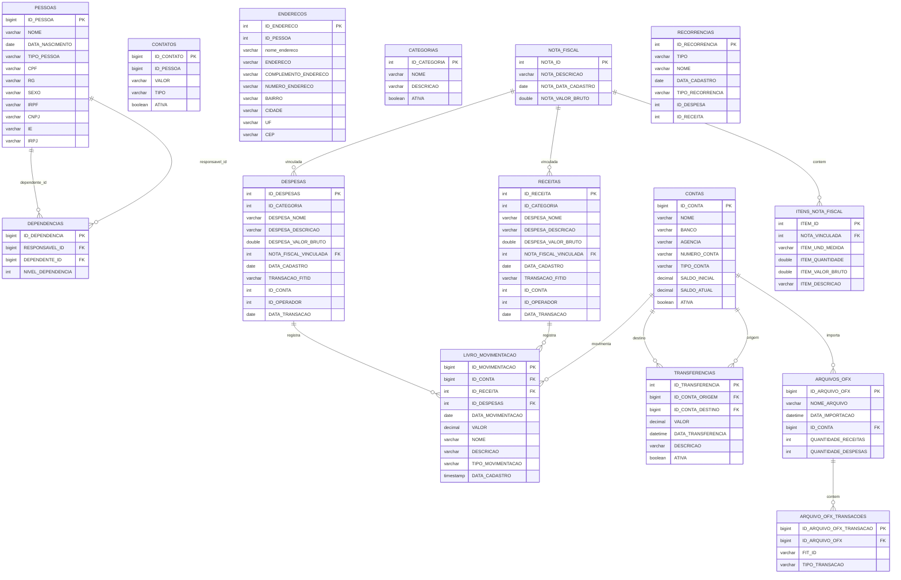
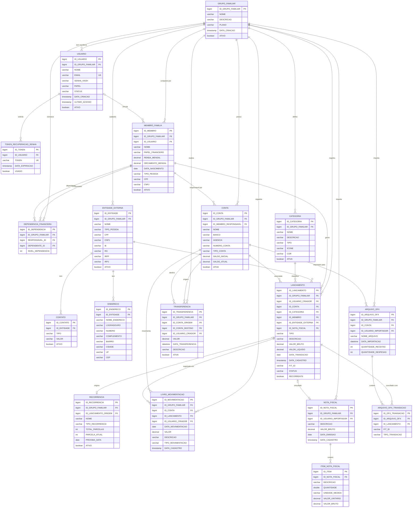

# MER — Organomeno: Análise e Evolução para Multi-Usuário

---

## 1. Diagnóstico do Modelo Atual

### 1.1 Problemas identificados

| # | Entidade | Problema |
|---|----------|----------|
| 1 | **Todas** | Nenhuma entidade possui `id_usuario` ou `id_grupo_familiar` — o sistema é single-tenant por design |
| 2 | **Conta** | Não tem dono: qualquer query retorna todas as contas de todos os usuários |
| 3 | **Categoria** | Global e compartilhada — sem isolamento por usuário ou família |
| 4 | **Despesas / Receitas** | Possuem `idOperador` (FK manual sem `@ManyToOne`) — rudimento de autoria sem implementação real |
| 5 | **Receitas** | Colunas com prefixo `DESPESA_` (ex: `DESPESA_NOME`, `DESPESA_VALOR_BRUTO`) — tabela foi copiada de `DESPESAS` sem renomear |
| 6 | **Pessoa** | Mistura dois conceitos: membros da família e fornecedores/terceiros |
| 7 | **Autenticacao** | `LoginDTO` está vazio — não existe entidade `Usuario` no modelo |
| 8 | **FKs manuais** | `idCategoria`, `idConta`, `idPessoa` são colunas simples sem `@ManyToOne`, quebrando integridade referencial no JPA |
| 9 | **GrupoFamiliar** | Não existe — o conceito central do sistema não tem representação no banco |
| 10 | **Recorrencia** | FKs para `Despesas` e `Receitas` são manuais, sem integridade referencial |

### 1.2 O que precisa ser adicionado para multi-usuário

Para tornar o sistema verdadeiramente multi-usuário, a estratégia é o modelo **"Grupo Familiar como Tenant"**:

- Cada família é um **GrupoFamiliar** (tenant)
- Cada **Usuario** pertence a um `GrupoFamiliar` com um papel (ADMIN, MEMBRO, VISUALIZADOR)
- Todas as entidades de negócio recebem FK para `GrupoFamiliar`, garantindo isolamento total dos dados
- **Pessoa** é separada em dois conceitos: membros da família (ligados ao `GrupoFamiliar`) e entidades externas (fornecedores/empresas)

---

## 2. MER Atual (estado do código)

---

## 3. MER Proposto — Multi-Usuário

### 3.1 Estratégia adotada: Grupo Familiar como Tenant

Cada `GrupoFamiliar` é um tenant isolado. Todos os dados financeiros pertencem a um grupo. Usuários entram no grupo com papéis distintos. A chave `id_grupo_familiar` é adicionada como FK em todas as entidades de negócio.

---

## 4. Detalhamento das mudanças

### 4.1 Entidades novas

| Entidade | Motivo |
|----------|--------|
| `GRUPO_FAMILIAR` | Tenant principal — isola todos os dados por família. Suporta múltiplas famílias no mesmo banco |
| `USUARIO` | Credencial de acesso com papel (ADMIN / MEMBRO / VISUALIZADOR) vinculado ao grupo |
| `TOKEN_RECUPERACAO_SENHA` | Suporte ao fluxo de recuperação de senha por email |
| `MEMBRO_FAMILIA` | Separação entre "membro da família" (com renda, orçamento, papel financeiro) e credencial de acesso (`USUARIO`) |
| `ENTIDADE_EXTERNA` | Renomeação de `PESSOA` — agora representa apenas fornecedores, empresas e terceiros externos |

### 4.2 Entidades modificadas

| Entidade | Mudanças |
|----------|----------|
| `CATEGORIA` | + `id_grupo_familiar` (FK) — categorias passam a ser por família; + `tipo` (RECEITA/DESPESA); + `icone` e `cor` (suporte à UI) |
| `CONTA` | + `id_grupo_familiar` (FK) + `id_membro_responsavel` (FK) — conta tem dono dentro da família |
| `LIVRO_MOVIMENTACAO` | + `id_grupo_familiar` (FK) + `id_usuario_criador` (FK) — rastreabilidade de quem lançou; simplificado: referencia um único `LANCAMENTO` em vez de `RECEITA` e `DESPESA` separados |
| `TRANSFERENCIA` | + `id_grupo_familiar` (FK) + `id_usuario_criador` (FK) |
| `NOTA_FISCAL` | + `id_grupo_familiar` (FK) + `id_usuario_importador` (FK) |
| `ARQUIVO_OFX` | + `id_grupo_familiar` (FK) + `id_usuario_importador` (FK) |
| `ARQUIVO_OFX_TRANSACAO` | + `id_lancamento` (FK) — transação OFX agora referencia o lançamento gerado, fechando o ciclo de conciliação |
| `RECORRENCIA` | Reestruturada — agora referencia um `LANCAMENTO` pai e controla parcelas individualmente |

### 4.3 Entidades consolidadas/removidas

| Entidade Antiga | Decisão | Motivo |
|----------------|---------|--------|
| `RECEITAS` + `DESPESAS` | **Consolidadas em `LANCAMENTO`** | As duas tabelas tinham estrutura idêntica (inclusive com prefixo `DESPESA_` nas colunas de `RECEITAS`). Um campo `TIPO` (`RECEITA` / `DESPESA`) resolve o problema sem duplicação de schema |
| `PESSOAS` | **Separada em `MEMBRO_FAMILIA` + `ENTIDADE_EXTERNA`** | Misturava dois conceitos distintos |

---

## 5. Campos de isolamento multi-tenant por entidade

Resumo de qual campo garante o isolamento dos dados por família:

| Entidade | Campo de tenant | Observação |
|----------|----------------|------------|
| `USUARIO` | `ID_GRUPO_FAMILIAR` | Direto |
| `MEMBRO_FAMILIA` | `ID_GRUPO_FAMILIAR` | Direto |
| `ENTIDADE_EXTERNA` | `ID_GRUPO_FAMILIAR` | Direto |
| `CATEGORIA` | `ID_GRUPO_FAMILIAR` | Direto |
| `CONTA` | `ID_GRUPO_FAMILIAR` | Direto |
| `LANCAMENTO` | `ID_GRUPO_FAMILIAR` | Direto |
| `LIVRO_MOVIMENTACAO` | `ID_GRUPO_FAMILIAR` | Direto |
| `TRANSFERENCIA` | `ID_GRUPO_FAMILIAR` | Direto |
| `NOTA_FISCAL` | `ID_GRUPO_FAMILIAR` | Direto |
| `ARQUIVO_OFX` | `ID_GRUPO_FAMILIAR` | Direto |
| `DEPENDENCIA_FINANCEIRA` | `ID_GRUPO_FAMILIAR` | Direto |
| `CONTATO` | Via `ID_ENTIDADE` → `ID_GRUPO_FAMILIAR` | Indireto |
| `ENDERECO` | Via `ID_ENTIDADE` → `ID_GRUPO_FAMILIAR` | Indireto |
| `ITEM_NOTA_FISCAL` | Via `ID_NOTA_FISCAL` → `ID_GRUPO_FAMILIAR` | Indireto |
| `ARQUIVO_OFX_TRANSACAO` | Via `ID_ARQUIVO_OFX` → `ID_GRUPO_FAMILIAR` | Indireto |
| `RECORRENCIA` | Via `ID_LANCAMENTO` → `ID_GRUPO_FAMILIAR` | Indireto |
| `TOKEN_RECUPERACAO_SENHA` | Via `ID_USUARIO` → `ID_GRUPO_FAMILIAR` | Indireto |

---

## 6. Papéis de usuário (PAPEL em USUARIO)

| Papel | Permissões |
|-------|-----------|
| `ADMIN` | Gerencia grupo, convida membros, acessa tudo |
| `MEMBRO` | Lança receitas/despesas, visualiza tudo dentro do grupo |
| `VISUALIZADOR` | Somente leitura — ideal para dependentes que acompanham o orçamento |

---

## 7. Plano de migração sugerido

### Fase 1 — Criar base multi-tenant (sem quebrar o que existe)
1. Criar tabela `GRUPO_FAMILIAR` com um registro padrão (`id=1, nome='Família Padrão'`)
2. Criar tabela `USUARIO` com o campo `id_grupo_familiar`
3. Adicionar coluna `id_grupo_familiar` em `CONTAS`, `CATEGORIAS` (com default `1`)
4. Adicionar coluna `id_grupo_familiar` em `LIVRO_MOVIMENTACAO`, `TRANSFERENCIAS`, `ARQUIVOS_OFX`

### Fase 2 — Consolidar RECEITAS e DESPESAS
5. Criar tabela `LANCAMENTO` unificada
6. Migrar dados de `RECEITAS` → `LANCAMENTO` com `tipo = 'RECEITA'`
7. Migrar dados de `DESPESAS` → `LANCAMENTO` com `tipo = 'DESPESA'`
8. Atualizar FKs em `LIVRO_MOVIMENTACAO` para apontar para `LANCAMENTO`
9. Deprecar tabelas `RECEITAS` e `DESPESAS`

### Fase 3 — Separar Pessoa
10. Criar `MEMBRO_FAMILIA` e `ENTIDADE_EXTERNA`
11. Migrar dados de `PESSOAS` para as novas tabelas com critério de negócio
12. Atualizar `DEPENDENCIAS` → `DEPENDENCIA_FINANCEIRA`

### Fase 4 — Rastreabilidade
13. Adicionar `id_usuario_criador` em todas as entidades de negócio
14. Implementar JWT com `claims`: `{ idUsuario, idGrupoFamiliar, papel }`
15. Implementar filtro global de tenant em todos os repositórios Panache

---

*Documento gerado em: junho de 2026*
*Baseado na análise do código-fonte em `backend-java/src/main/java/br/com/organomeno/`*
